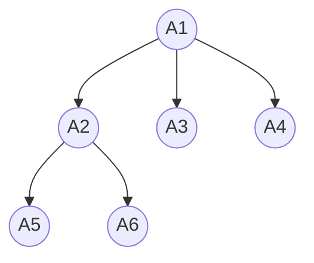
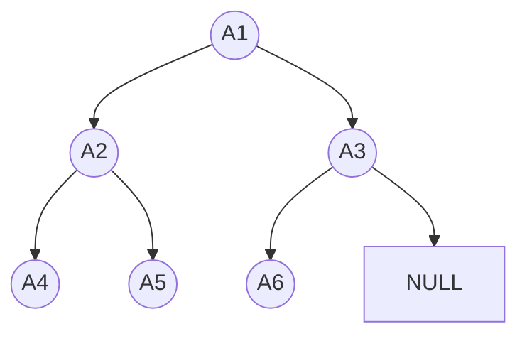
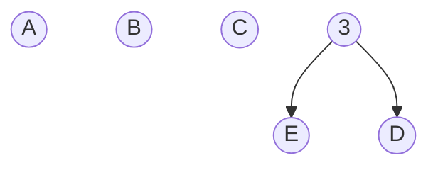
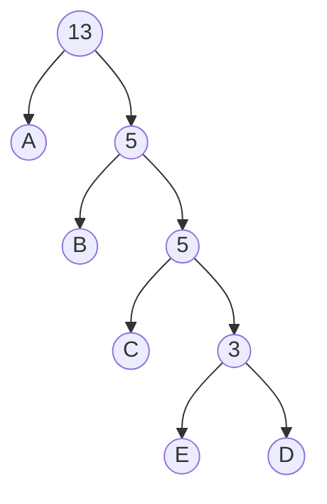
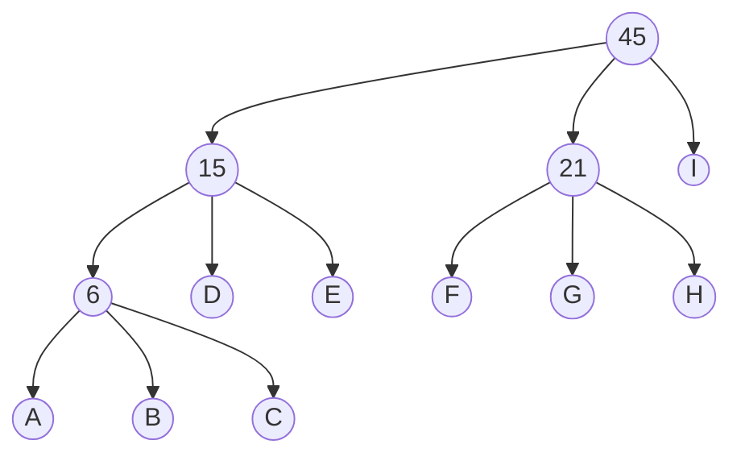

# 树
1. ## 基础
1. ### 特点
	- 一对多的关系
	- 递归关系

2. ### 定义
	- 结点：体现数据信息已经逻辑关系的结构
	- 结点的度：结点所引出的分支的个数
	- 树的度：该树中所有结点的最大分支数（所有结点的最大度数）
	- 叶子结点：度为0的结点
	- 孩子结点：与某个结点有直接关系的下一层结点
	- 双亲结点：与某个结点有直接关系的上一层结点
	- 祖先：从某个结点向上直到根结点的所有结点（不包括其余分支）
	- 子孙：某个结点向下所引出的所有结点
	- 兄弟结点：有同一双亲结点的几个结点互称为兄弟结点
	- 堂兄弟结点：双亲结点互为兄弟结点的几个结点互称为堂兄弟结点
	
	- 树的层次：根结点为第一层，依次往下分别为二、三...
	- 树的高度（深度）：树的最大层次数
	- 结点的高度：距离最底层的结点的层数（最低层结点的高度为1）
	- 结点的深度：距离根结点的层数（根结点的深度为1）

3. ### 存储结构


1. #### 顺序存储结构

| 下标 | 0 | 1 | 2 | 3 | 4 | 5 |
| -- | -- | -- | -- | -- | -- | -- |
| 数据 | $A_1$ | $A_2$ | $A_3$ | $A_4$ | $A_15$ | $A_6$ |
| 父结点 | -1 | 0 | 0 | 0 | 1 | 1 |

```C++
class TNode
{
	int data;//数据
	int pInx;//父节点
}
```
2. #### 链式存储结构	

	孩子存储结构


2. ## 二叉树
1. ### 定义

- 每个结点最多两个子树
- 子树有左右次序之分

2. ### 形态

- 无结点
- 只有根结点
- 只有左结点
- 只有右结点
- 既有左节点又有右节点

3. ### 特殊二叉树

- 满二叉树
	除了最底层结点，其他结点都有左右两结点
- 完全二叉树
	将满二叉树从右往左依次删除结点得到的二叉树
	满二叉树是一种特殊的完全二叉树+

4. ### 性质

1. 节点数 = 分支数 + 1
2. N_0_ = N_2_ + 1

5. ### 存储结构

1. 顺序存储结构
	
2. 链式存储结构（二叉链表存储结构）

	```C++
	class BTNode
	{
	int data;
	BTNode* lChild;
	BTNode* rChild;
	}
	```

6. ### 树与二叉树的互相转化

1. ### 树转化成二叉树


树的孩子兄弟存储结构


```C++
class BTNode
{
int data;
BTNode* child;
BTNode* sidling;
}
```

2. ### 二叉树转化为树

3. ### 森林转化为二叉树


4. ### 二叉树转化为森林


3. ## 遍历
1. ### 二叉树的遍历

1. #### 广度优先遍历（层次遍历）

层从上到下，层内从左到右
A_1_  -> A_2_  ->  A_3_ -> A_4_ -> A_5_ -> A_6_ 

2. #### 深度优先遍历


遍历过程中每个结点有三次机会被访问，按照访问的时机不同（第一/二/三次）分为：

- 先序遍历（第一次来到该结点时访问）
	$$ A_1 \rightarrow A_2 \rightarrow A_4 \rightarrow A_5 \rightarrow A_3 \rightarrow A_6 $$
	根结点 \rightarrow 左子树 \rightarrow 右子树

- 中序遍历（第二次来到该结点时访问）
	$$A_4 \rightarrow A_2 \rightarrow A_5 \rightarrow A_1 \rightarrow A_6 \rightarrow A_3 $$
	左子树 \rightarrow 根结点 \rightarrow 右子树

- 后序遍历（第三次来到该结点时访问）
	$$A_4 \rightarrow A_5 \rightarrow  A_2 \rightarrow A_6 \rightarrow A_3 \rightarrow A_1 $$
	左子树\rightarrow 右子树 -> 根结点
```C++
void r(BTNode* p)
{
	if(p != NULL)
	{
		//visit(p)//调用此段代码，为先序遍历
		r(p->lChild);
		//visit(p)//调用此段代码，为中序遍历
		r(p->rChild);
		//visit(p)//调用此段代码，为后序遍历
	}
}
```


2. ### 树的遍历


1. #### 层次遍历/广度优先遍历
	层从上到下，层内从左到右
	$$ A_1 \rightarrow A_2 \rightarrow A_3 \rightarrow A_4 \rightarrow A_5 \rightarrow A_6 $$

2. #### 深度优先遍历
遍历过程中每个结点**至少**有三次机会被访问，按照访问的时机不同（第一/最后）分为：

- ##### 先序遍历（第一次来到该结点时访问）
	$$ A_1  \rightarrow A_2  \rightarrow  A_5 \rightarrow A_6 \rightarrow A_3 \rightarrow A_4 $$
	根结点 \rightarrow 子树（从左到右）

- ##### 后序遍历（最后一次来到该结点时访问）
	$$ A_5 \rightarrow A_6 \rightarrow  A_2 \rightarrow A_3 \rightarrow A_4 \rightarrow A_1 $$
	子树（从左到右） \rightarrow 根结点

> 一般的树没有中序遍历
> 一般树的先序遍历顺序与其对应的二叉树的先序遍历顺序相同
> 一般树的后序遍历顺序与其对应的二叉树的中序遍历顺序相同
>
> > 一般树的逆序层次遍历顺序与其对应的二叉树的后序遍历顺序相同？？


3. ### 森林的遍历

1. 先序遍历：先序遍历森林中的每棵树
2. 后序遍历：后序遍历森林中的每棵树

4. ## 线索二叉树

1. ### 前序线索二叉树

2. ### 中序线索二叉树

3. ### 后序线索二叉树

5. ## 哈夫曼树

1. ### 作用

   缩短编码长度

2. ### 构造方法

   1. 将各字符的权值设为其出现次数
   2. 将两个出现次数最小的结点作为一个新结点的左右子树。新结点的权值为两结点之和
   3. 重复步骤 2，将所有结点都连成一棵二叉树
   4. 给每个左分支标记1，给每个右分支标记0
   5. 从根结点出发走向每个叶子结点所途径的1和0构成该叶子结点字符的哈夫曼编码

3. ### 原理

4. ### 例子
     >  $$AAABBACCCDEEA$$
   
| A    | C    | B    | E    | D    |
| ---- | ---- | ---- | ---- | ---- |
| 5    | 3    | 2    | 2    | 1    |


| A    | C    | B    | E    | D    |
| ---- | ---- | ---- | ---- | ---- |
| 5    | 3    | 2    | 2    | 1    |
| 1    | 01   | 001  | 0001 | 0000 |

3. 定义
	路径：两个结点之间分支所构成的路线
	路径长度：路径上的分支个数
	树的路径长度：从根结点到每个结点的路径长度之和
	带权路径长度：该节点到根结点的路径长度乘以该节点权值
	树的带权路径长度：树中各叶子节点的带权路径长度之和	
	
4. 特点
	- 权值越大的结点，距离离根结点越近
	- 树中没有度为1的结点，是正则（严格）二叉树
	- 哈夫曼树的带权路径长度最短（即编码后的长度最短）
5. 哈夫曼n叉树

>**必须有1+2n个叶子结点**才能保证得到的每个非叶结点都有三个子结点
如果结点数不是1+2n可以加入权值为0的结点。加入权值为0的结点不会改变三叉树的权值。
